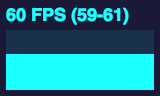
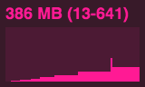
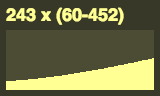

# Performance Monitor for WebGL

-   **FPS** Frames rendered in the last second.
-   **MS** Milliseconds needed to render a frame.
-   **MB** MBytes of allocated memory.
-   **DC** Draw Calls made within one frame.
-   **TC** Texture Count used within one frame.
-   **CUSTOM** User-defined panel support.

### Screenshots

